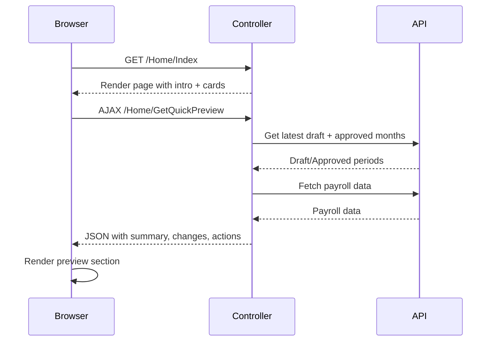

# Home Page Redesign

## Overview

Redesign `Index.cshtml` to provide immediate value with a hybrid approach: static introduction + auto-loading analysis preview when draft payroll is available.

## Key Changes

### 1. Page Introduction Section

Add a concise 2-3 sentence introduction at the top:

```html
<div class="alert alert-light border mb-4">
  <h5>Payroll Review Dashboard</h5>
  <p class="mb-0">
    This tool helps payroll administrators and finance reviewers verify draft payrolls before approval.
    It compares your current draft against the last approved period to surface changes that need attention.
    <strong>Start with the Quick Preview below</strong>, then drill into specific features for details.
  </p>
</div>
```

### 2. Quick Preview Section (Auto-Loading)

Add a new section between the intro and feature cards that auto-loads when a draft payroll exists:

- Calls a new AJAX endpoint `/Home/GetQuickPreview` on page load
- Shows a loading spinner while fetching
- Displays:
  - **Summary**: High-level payroll overview (headcount, cost trend)
  - **Key Changes**: Top 2-3 change groups with concise descriptions
  - **Suggested Actions**: Up to 3 optional review actions based on findings
- Falls back gracefully if no draft or API not configured

### 3. Suggested Review Actions

Based on analysis results, show up to 3 contextual actions:

```html
<div class="card mb-4">
  <div class="card-header">Suggested Review Actions</div>
  <div class="card-body">
    <ul class="list-group list-group-flush">
      <li>Review 3 employees with leave adjustments in Detailed Changes</li>
      <li>Check 2 new hires in Payroll Summary for onboarding verification</li>
      <li>Investigate tax deduction changes flagged in Risk & Review</li>
    </ul>
  </div>
</div>
```

### 4. Streamlined Feature Cards

Keep 3 separate cards but update descriptions to avoid repetition:

- **Payroll Summary**: "View totals, percentage changes, and top contributors"
- **Detailed Changes**: "Drill into specific employee-level changes"  
- **Risk & Review**: "Flag unusual patterns that need verification"

### 5. Remove Redundant Info Box

Remove the "Analysis Features" alert box at the bottom (its content will be incorporated into the intro and preview sections).

## Files to Modify

- [HomeController.cs](Analytics/PayrollIntelligence.Web/Controllers/HomeController.cs) - Add `GetQuickPreview` endpoint
- [Index.cshtml](Analytics/PayrollIntelligence.Web/Views/Home/Index.cshtml) - Redesign layout with new sections
- [PayrollAnalysisService.cs](Analytics/PayrollIntelligence.Core/PayrollAnalysisService.cs) - Add quick preview method (optional, can reuse existing)

## Data Flow



## UX Guidelines Applied

- **Introduction**: Under 3 sentences, explains page purpose, audience, and focus
- **Change Summaries**: Concise, explain what changed and why it matters
- **Suggested Actions**: Up to 3 optional actions, no automatic corrections
- **No Redundancy**: Each section references earlier insights rather than repeating